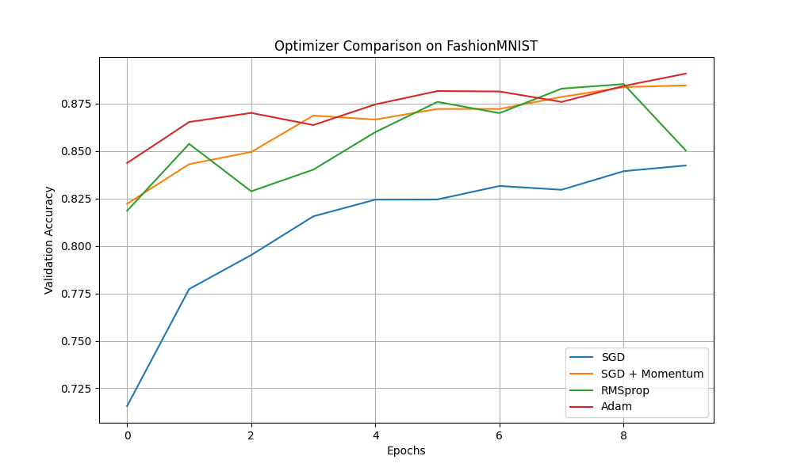
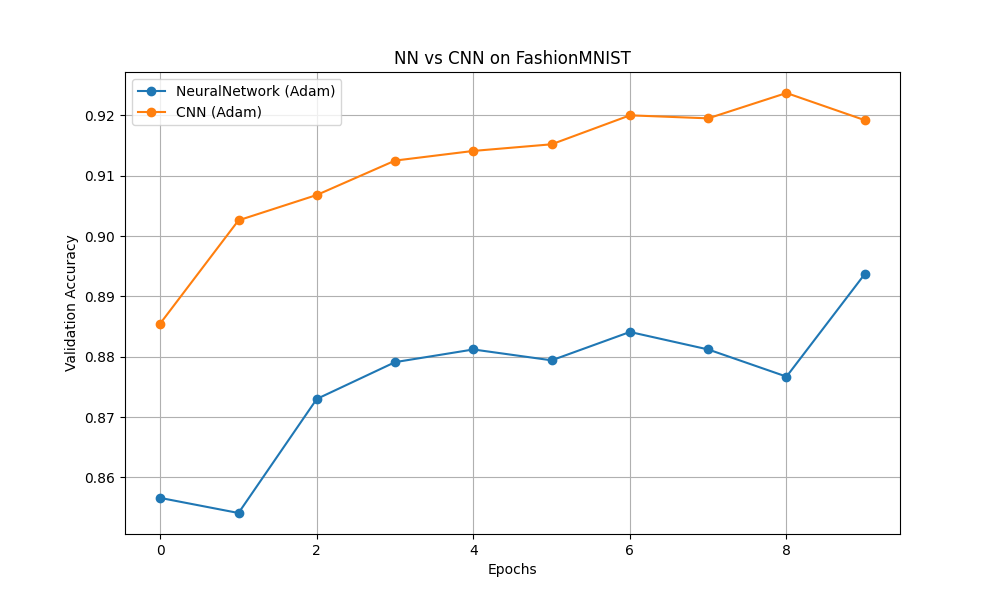

# Deep Learning with FashionMNIST

Welcome to my Deep Learning learning journey! This project explores the fundamentals of Neural Networks using PyTorch and the FashionMNIST dataset.

The goal of this repository is not just to reach high accuracy, but to **understand the "why" and "how"** behind model decisions, hyperparameters, and architectures.

## Table of Contents
1. [Neural Network Basics](#neural-network-basics)
2. [Experiment 1: Battle of the Optimizers](#experiment-1-battle-of-the-optimizers)
3. [Experiment 2: NN vs. CNN](#experiment-2-nn-vs-cnn)
4. [How to Run](#how-to-run)


---

## Neural Network Basics

This project uses a standard **Neural Network (NN)** (often called a Multi-Layer Perceptron) as our baseline.

### Key Components

*   **`nn.Linear` (The Transformation)**:
    It takes input numbers, multiplies them by learned weights, and adds a bias ($y = mx + b$). It transforms the data from one shape to another (e.g., from 784 pixels to 512 features).

*   **`nn.ReLU` (The Spark of Complexity)**:
    Without this, our network would just be one big linear regression, no matter how many layers we add! ReLU (Rectified Linear Unit) introduces **non-linearity** by simply turning negative numbers to zero. This allows the network to learn complex patterns like curves and shapes, not just straight lines.

### Key Hyperparameters

*   **Batch Size**: The number of images processed at once. A larger batch size is faster but requires more memory; a smaller one provides a "noisier" but often better generalization.
*   **Learning Rate (LR)**: The "step size" the optimizer takes. Too big, and you overshoot the target (diverge); too small, and you never reach it (too slow).
*   **Epochs**: One full pass through the entire dataset. We usually need multiple epochs to learn effectively.


## Experiment 1: Battle of the Optimizers

We compared four configurations to see who could climb down the "Mountain of Error" the fastest:

1.  **SGD (The Tortoise)**: Uses a fixed step size. Reliable but slow.
2.  **SGD + Momentum (The Rolling Stone)**: Adds "inertia" to SGD. It gains speed downhill and pushes through small bumps, but still uses the **same step size** for all parameters.
3.  **RMSprop (The Adaptive Hiker)**: Adjusts its step size based on the terrain (gradients). If the slope is steep, it slows down to stabilize.
4.  **Adam (The Champion)**: Combines the best of both worlds. It has **Momentum** (speed) AND **Adaptive Learning Rates** (control) for *each individual parameter*. This makes it much more efficient than SGD + Momentum, which applies the same learning rate to everything.

### Results
We trained the same model architecture with each optimizer for 10 epochs.



*Observation: As expected, Adam and RMSprop converged much faster than plain SGD, reaching higher accuracy in fewer epochs.*

---

## Experiment 2: NN vs. CNN

After finding our champion optimizer (Adam), we pitted our best Neural Network against a Convolutional Neural Network (CNN).

### The Challenge
Standard NNs have a major flaw with images: **They flatten the 2D image into a 1D line.**
*   The network loses "spatial awareness." It doesn't know that pixel 1 is next to pixel 2.
*   It's like trying to recognize a face by reading a list of pixels describing eye color, nose shape, etc., without knowing *where* they are on the face.

### The Solution: CNN
CNNs scan the image using **Filters (Convolutions)** instead of flattening it.

*   **The Analogy**:
    *   **NN**: Looks at a "pixel soup."
    *   **CNN**: Scans the image with a **magnifying glass** (filter). It looks for patterns like edges, curves, and textures, regardless of where they are in the image.

### Results


*The CNN achieved significantly higher accuracy (~92%) compared to the standard NN (~88%), proving that preserving spatial structure is key for image recognition.*

---

## How to Run

1.  **Install Dependencies** (using `uv` or `pip`):
    ```bash
    uv sync
    # OR
    pip install torch torchvision matplotlib
    ```
then go through the notebooks!

